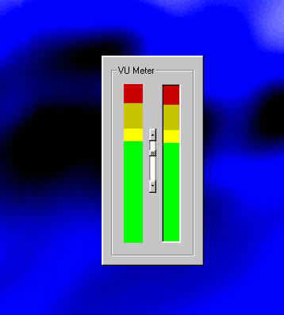



## VU\_Meter

### Description

AxtiveX VU Meter.
 
### More Info
 

             |
---                |---
**Submitted On**   |2001-04-12 15:56:52
**By**             |[Jerrame Hertz](https://github.com/Planet-Source-Code/PSCIndex/blob/master/ByAuthor/jerrame-hertz.md)
**Level**          |Beginner
**User Rating**    |5.0 (10 globes from 2 users)
**Compatibility**  |VB 5\.0, VB 6\.0
**Category**       |[Custom Controls/ Forms/  Menus](https://github.com/Planet-Source-Code/PSCIndex/blob/master/ByCategory/custom-controls-forms-menus__1-4.md)
**World**          |[Visual Basic](https://github.com/Planet-Source-Code/PSCIndex/blob/master/ByWorld/visual-basic.md)
**Archive File**   |[VU\_Meter182894122001\.zip](https://github.com/Planet-Source-Code/jerrame-hertz-vu-meter__1-22360/archive/master.zip)

